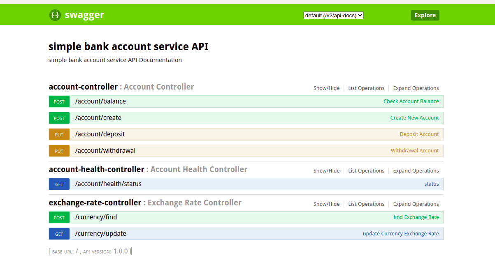

# Simple Bank Account Service API

### OBJECTIVE

   * Build a simple self-contained bank account REST service. While being a simple fictive assignment feel
free to add other aspects to make it more production ready.

### FUNCTIONAL REQUIREMENTS

   * Support create account   	   	
   * Support deposit and withdrawal to account.
   * Support show account balance in currency of choice. Currency of the account (used in deposit
		and withdrawal) is SEK.
   * Currency exchange rates should be static but changing to fetch it from an external REST
	service should be fairly easy.
   * Negative account balance is not allowed.

### TECHNICAL REQUIREMENTS

   * Account number of 9 digits.
   * Use Java 11 (or later).
   * Use Spring Boot 2.x.
   * Allow concurrent operations.
   * Use in memory data structures or in memory database.

### Bank Account API 

   * POST http://localhost:8080/account/create
   
    {
	  "address": "Kronvagan 26A",
	  "country": "Sweden",
	  "dateOfBirth": "1983-09-01",
	  "emailAddress": "thusithaid@yahoo.com",
	  "firstName": "Thusitha",
	  "lastName": "Dissanayaka",
	  "personalNumber": 198309010000,
	  "phoneNumber": 0727869462
	}
	
   * PUT http://localhost:8080/account/deposit
   
    {
	  "accountNumber": 100000001,
	  "amount": "100.00"
	}
	
   * POST http://localhost:8080/account/balance
   
    {
	  "accountNumber": 100000001,
	  "currency": "SEK"
	}

   * PUT http://localhost:8080/account/withdrawal
   
    {
	  "accountNumber": 100000001,
	  "amount": "100.00"
	}
	    

### Prerequisites to run Bank Account System :
   * git
   * Java 11
   * Docker 20
   * Docker-compose 20
   * elasticsearch 7.11.2
   
   
### Build Bank Account Application :

	cd {{ WORKSPACE_PATH }}
	git clone https://github.com/idthusitha/simple-bank-account-service.git
	cd  simple-bank-account-service
	./gradlew clean build
		
	#Docker image build
	./gradlew clean buildDocker
	

### Run ElasticSearch :

	 #Start ElasticSearch
	 cd /[project-home-directory]/docker/elasticsearch
	 sudo docker-compose up

### Run Bank Account Application :

#####Start the application with Boot Run
	cd /[project-home-directory]
	./gradlew bootRun
		
#####Start the application with Boot Run with debug enable
	./gradlew clean build bootRun --debug-jvm
	Listening for transport dt_socket at address: 5005
	 	 
#####Start the application with docker
	 cd /[project-home-directory]
	 ./gradlew clean buildDocker
	 
	 cd /[project-home-directory]/docker/application
	 sudo docker-compose up

### Application Swagger API

	http://localhost:8080/swagger-ui.html#

